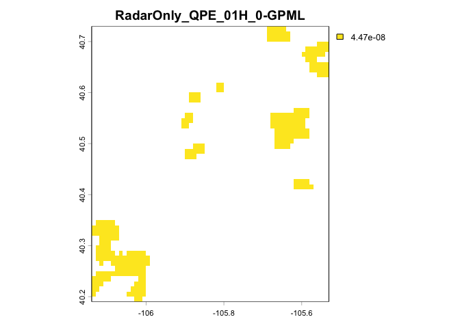

<!-- README.md is generated from README.Rmd. Please edit that file -->

# mrmsR

<!-- badges: start -->

[](https://github.com/searsmg/mrmsR/actions/workflows/R-CMD-check.yaml)
[](https://doi.org/10.5281/zenodo.22908308)
<!-- badges: end -->

Tools for processing NOAA MRMS (Multi-Radar Multi-Sensor) gridded
precipitation data and generating watershed-scale rainfall statistics.

## Overview

`mrmsR` supports a four-step workflow for turning MRMS gridded
precipitation data into watershed-scale rainfall statistics:

1.  **`downloadMRMS()`** — download MRMS GRIB2 files for a time range
    from the Iowa State Mesonet archive (or the NOAA AWS bucket, for
    `SHSRHeight`).
2.  **`prepMRMS()`** — project and crop the raw GRIB2 rasters to a
    boundary, writing GeoTIFFs.
3.  **`zonalMRMS()`** — compute the zonal mean precipitation over each
    catchment in the boundary for every raster, writing one CSV per
    timestep.
4.  **`combineCSV()`** — combine those per-timestep CSVs into a single,
    datetime-sorted data frame.

The package is designed for high-volume hydroclimatic workflows and
supports efficient batch and parallel processing.

## Installation

`mrmsR` is only available on GitHub. Install the latest version using
[pak](https://pak.r-lib.org/):

``` r
# install.packages("pak")
pak::pak("searsmg/mrmsR")
```

To install a specific release (for example, to match a version you’ve
cited):

``` r
pak::pak("searsmg/mrmsR@v0.1.0")
```

## Example

The example below runs the full pipeline. Downloading requires a network
connection and can produce a lot of files, so that step is shown but not
run here. The remaining steps run on a small example dataset bundled
with the package (also used in `vignette("mrmsR")`), so every output
below is reproducible.

``` r
library(mrmsR)
```

### Step 1: Downloading MRMS data

``` r
downloadMRMS(
  start = lubridate::ymd_hm("2025-01-01 02:00"),
  end = lubridate::ymd_hm("2025-01-01 06:00"),
  destination = "mrms_rasters",
  product = "RadarOnlyQPE"
)
```

`product` controls both the data source and the temporal resolution of
the files that get downloaded:

| Product             | Resolution | Source                     |
|---------------------|------------|----------------------------|
| `RQI`               | 2 minutes  | Iowa State Mesonet archive |
| `MultiSensorQPE`    | hourly     | Iowa State Mesonet archive |
| `RadarOnlyQPE`      | hourly     | Iowa State Mesonet archive |
| `SurfacePrecipRate` | 2 minutes  | Iowa State Mesonet archive |
| `SHSRHeight`        | 2 minutes  | NOAA MRMS AWS bucket       |

MRMS file names are in UTC. `start` and `end` can be in any time zone
(e.g., `lubridate::ymd_hm("2025-07-03 14:00", tz = "America/Chicago")`);
they’re converted to UTC before files are requested. `destination` is
created if it doesn’t exist.

`downloadMRMS()` returns a list of the `POSIXct` timestamps (in UTC) it
could not download. An empty list means every file in the range
downloaded and unzipped successfully.

### Example data

``` r
grib_dir <- system.file("extdata", "grib2", package = "mrmsR")
boundary <- system.file("extdata", "boundary", "catchments_all_lidar.shp", package = "mrmsR")

list.files(grib_dir)
#> [1] "RadarOnly_QPE_01H_00.00_20250101-020000.grib2"
#> [2] "RadarOnly_QPE_01H_00.00_20250101-030000.grib2"
```

### Step 2: Cropping rasters to a boundary

``` r
tif_dir <- file.path(tempdir(), "mrmsR-readme-tif")
dir.create(tif_dir, showWarnings = FALSE)

prepMRMS(
  dir = grib_dir,
  output_dir = tif_dir,
  num_cores = 1,
  boundary = boundary
)
#> 2 files to process.
#> Processing complete!

list.files(tif_dir)
#> [1] "RadarOnly_QPE_01H_00.00_20250101-020000_processed.tif"
#> [2] "RadarOnly_QPE_01H_00.00_20250101-030000_processed.tif"
```

``` r
r <- terra::rast(list.files(tif_dir, full.names = TRUE)[1])
terra::plot(r, main = names(r))
```



### Step 3: Zonal statistics per catchment

`zonalMRMS()` computes the mean precipitation within each catchment
polygon and writes one CSV per raster, named
`extract_<year>_<doy>_<hour>_<min>.csv`. The `catchment` column comes
from the boundary’s `site` attribute if it has one; use `id_col` to pick
a different attribute. Set `n_workers` above 1 to process rasters in
parallel.

``` r
csv_dir <- file.path(tempdir(), "mrmsR-readme-csv")
dir.create(csv_dir, showWarnings = FALSE)

zonalMRMS(
  raster_dir = tif_dir,
  output_dir = csv_dir,
  boundary = boundary,
  n_workers = 1
)
#> Zonal stats complete

list.files(csv_dir)
#> [1] "extract_2025_1_02_00.csv" "extract_2025_1_03_00.csv"
```

### Step 4: Combining timesteps into one time series

``` r
combined <- combineCSV(csv_dir)

combined
#>        ID       p_mmhr  catchment            datetime  year   doy  hour   min
#>     <int>        <num>     <char>              <POSc> <int> <int> <int> <int>
#>  1:     1 4.470348e-08        dry 2025-01-01 02:00:00  2025     1     2     0
#>  2:     2 4.470348e-08    washout 2025-01-01 02:00:00  2025     1     2     0
#>  3:     3 4.470348e-08       dadd 2025-01-01 02:00:00  2025     1     2     0
#>  4:     4 4.470348e-08      aspen 2025-01-01 02:00:00  2025     1     2     0
#>  5:     5 4.470348e-08        bl4 2025-01-01 02:00:00  2025     1     2     0
#>  6:     6 4.470348e-08 montgomery 2025-01-01 02:00:00  2025     1     2     0
#>  7:     7 4.470348e-08   mtcampus 2025-01-01 02:00:00  2025     1     2     0
#>  8:     8 4.470348e-08   michigan 2025-01-01 02:00:00  2025     1     2     0
#>  9:     9 4.470348e-08    bighorn 2025-01-01 02:00:00  2025     1     2     0
#> 10:    10 4.470348e-08         p1 2025-01-01 02:00:00  2025     1     2     0
#> 11:    11 4.470348e-08         p2 2025-01-01 02:00:00  2025     1     2     0
#> 12:    12 4.470348e-08        hum 2025-01-01 02:00:00  2025     1     2     0
#> 13:    13 4.470348e-08         hm 2025-01-01 02:00:00  2025     1     2     0
#> 14:    14 4.470348e-08        mum 2025-01-01 02:00:00  2025     1     2     0
#> 15:    15 4.470348e-08        mpm 2025-01-01 02:00:00  2025     1     2     0
#> 16:    16 4.470348e-08         mm 2025-01-01 02:00:00  2025     1     2     0
#> 17:    17 4.470348e-08        mub 2025-01-01 02:00:00  2025     1     2     0
#> 18:    18 4.470348e-08        lum 2025-01-01 02:00:00  2025     1     2     0
#> 19:    19 4.470348e-08        lpm 2025-01-01 02:00:00  2025     1     2     0
#> 20:    20 4.470348e-08         lm 2025-01-01 02:00:00  2025     1     2     0
#> 21:    21 4.470348e-08         UE 2025-01-01 02:00:00  2025     1     2     0
#> 22:    22 4.470348e-08         UM 2025-01-01 02:00:00  2025     1     2     0
#> 23:    23 4.470348e-08         UW 2025-01-01 02:00:00  2025     1     2     0
#> 24:    24 4.470348e-08         MM 2025-01-01 02:00:00  2025     1     2     0
#> 25:    25 4.470348e-08         MW 2025-01-01 02:00:00  2025     1     2     0
#> 26:    26 4.470348e-08         ME 2025-01-01 02:00:00  2025     1     2     0
#> 27:     1 4.470348e-08        dry 2025-01-01 03:00:00  2025     1     3     0
#> 28:     2 4.470348e-08    washout 2025-01-01 03:00:00  2025     1     3     0
#> 29:     3 4.470348e-08       dadd 2025-01-01 03:00:00  2025     1     3     0
#> 30:     4 4.470348e-08      aspen 2025-01-01 03:00:00  2025     1     3     0
#> 31:     5 4.470348e-08        bl4 2025-01-01 03:00:00  2025     1     3     0
#> 32:     6 4.470348e-08 montgomery 2025-01-01 03:00:00  2025     1     3     0
#> 33:     7 4.470348e-08   mtcampus 2025-01-01 03:00:00  2025     1     3     0
#> 34:     8 4.470348e-08   michigan 2025-01-01 03:00:00  2025     1     3     0
#> 35:     9 4.470348e-08    bighorn 2025-01-01 03:00:00  2025     1     3     0
#> 36:    10 4.470348e-08         p1 2025-01-01 03:00:00  2025     1     3     0
#> 37:    11 4.470348e-08         p2 2025-01-01 03:00:00  2025     1     3     0
#> 38:    12 4.470348e-08        hum 2025-01-01 03:00:00  2025     1     3     0
#> 39:    13 4.470348e-08         hm 2025-01-01 03:00:00  2025     1     3     0
#> 40:    14 4.470348e-08        mum 2025-01-01 03:00:00  2025     1     3     0
#> 41:    15 4.470348e-08        mpm 2025-01-01 03:00:00  2025     1     3     0
#> 42:    16 4.470348e-08         mm 2025-01-01 03:00:00  2025     1     3     0
#> 43:    17 4.470348e-08        mub 2025-01-01 03:00:00  2025     1     3     0
#> 44:    18 4.470348e-08        lum 2025-01-01 03:00:00  2025     1     3     0
#> 45:    19 4.470348e-08        lpm 2025-01-01 03:00:00  2025     1     3     0
#> 46:    20 4.470348e-08         lm 2025-01-01 03:00:00  2025     1     3     0
#> 47:    21 4.470348e-08         UE 2025-01-01 03:00:00  2025     1     3     0
#> 48:    22 4.470348e-08         UM 2025-01-01 03:00:00  2025     1     3     0
#> 49:    23 4.470348e-08         UW 2025-01-01 03:00:00  2025     1     3     0
#> 50:    24 4.470348e-08         MM 2025-01-01 03:00:00  2025     1     3     0
#> 51:    25 4.470348e-08         MW 2025-01-01 03:00:00  2025     1     3     0
#> 52:    26 4.470348e-08         ME 2025-01-01 03:00:00  2025     1     3     0
#>        ID       p_mmhr  catchment            datetime  year   doy  hour   min
#>     <int>        <num>     <char>              <POSc> <int> <int> <int> <int>
```

From here, `combined` is a normal data frame — grouping by `catchment`
and summarizing over `datetime` with your usual `dplyr`/`tidyr` tools
will get you catchment-level rainfall totals or hyetographs.

See `vignette("mrmsR")` for more detail on each step.

## Citation

If you use `mrmsR`, please cite it using its Zenodo DOI:

> Sears, M. mrmsR: Download and process MRMS data. Zenodo.
> <https://doi.org/10.5281/zenodo.22908308>

That DOI always points to the latest release. Each release also has its
own DOI, listed on the [Zenodo
record](https://doi.org/10.5281/zenodo.22908308), for citing the exact
version you used. GitHub’s **Cite this repository** button gives the
same citation in APA and BibTeX formats.

## Project status

`mrmsR` is in early development. Version 0.1.0 is the first release.

- Function names, arguments, and outputs may still change between
  versions
- Breaking changes are listed in [NEWS.md](NEWS.md)

### Planned improvements

- Performance optimization for large datasets
- Option to pull MRMS either by catchment (boundary) or point
- Option to summarize by max and other summary stats
- Review by others
